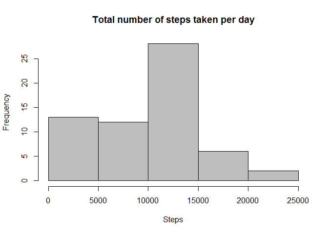
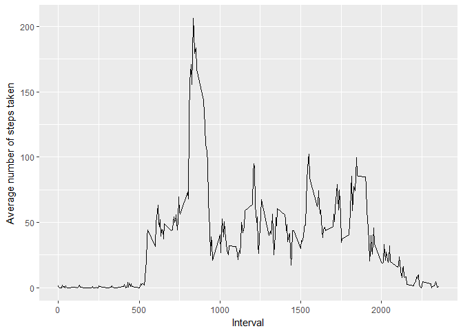
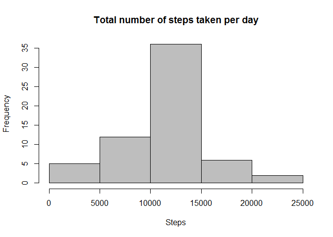
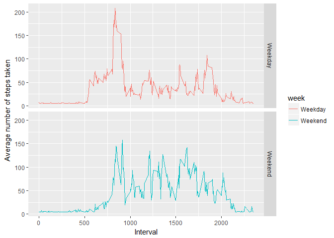

# Reproducible Research: Peer Assessment 1


## Loading and preprocessing the data

```r
# Load the required library
library(ggplot2)
library(dplyr)

# Read the csv file into memory
mydf <- read.csv("activity.csv")
```


## What is mean total number of steps taken per day?

```r
# Group the data by date and calculate the total steps taken per day
d1 <- group_by(mydf, date)
s1 <- summarise(d1, Total.Steps = sum(steps, na.rm = TRUE))

# Plot the histogram of the total number of steps taken per day
hist(s1$Total.Steps, col = "gray", xlab = "Steps", main = "Total number of steps taken per day")
```

<!-- -->

```r
# Mean of the total number of steps taken per day
mean(s1$Total.Steps)
```

```
## [1] 9354.23
```

```r
# Median of the total number of steps taken per day
median(s1$Total.Steps)
```

```
## [1] 10395
```


## What is the average daily activity pattern?

```r
# Group the data by interval and calculate the average steps
d2 <- group_by(mydf, interval)
s2 <- summarise(d2, Average.Steps = mean(steps, na.rm = TRUE))

# Plot the time series plot of the 5-minute interval and the average number of steps taken, averaged across all days
g1 <- ggplot(s2, aes(interval, Average.Steps))
g1 + geom_line() + labs(x = "Interval", y = "Average number of steps taken")
```

<!-- -->

```r
# The 5-minute interval on average across all the days which contains the maximum number of steps
s2[s2$Average.Steps == max(s2$Average.Steps), ]
```

```
## # A tibble: 1 × 2
##   interval Average.Steps
##      <int>         <dbl>
## 1      835      206.1698
```


## Imputing missing values

```r
# Total number of NA's in the data
sum(is.na(mydf))
```

```
## [1] 2304
```

```r
# Calculate the mean and use it to fill up the NA's values
mean_step = mean(mydf$steps, na.rm = TRUE)
new_mydf <- mydf
new_mydf[is.na(new_mydf), ]$steps <- mean_step

# Group the new dataset by date and calculate the total steps taken per day
new_d1 <- group_by(new_mydf, date)
new_s1 <- summarise(new_d1, Total.Steps = sum(steps))

# Plot the histogram of the total number of steps taken per day
hist(new_s1$Total.Steps, col = "gray", xlab = "Steps", main = "Total number of steps taken per day")
```

<!-- -->

```r
# New mean of the total number of steps taken per day based on new dataset
mean(new_s1$Total.Steps)
```

```
## [1] 10766.19
```

```r
# New median of the total number of steps taken per day based on new dataset
median(new_s1$Total.Steps)
```

```
## [1] 10766.19
```


## Are there differences in activity patterns between weekdays and weekends?

```r
# Convert the date into the its correct type and format
new_mydf$date <- as.Date(new_mydf$date, "%Y-%m-%d")
new_mydf <- mutate(new_mydf, day = weekdays(new_mydf$date))

# Label the data accordingly into "weekday" and "weekend"
new_mydf$week <- "Weekday"
new_mydf[new_mydf$day == "Saturday" | new_mydf$day == "Sunday", ]$week <- "Weekend"
new_mydf$week <- as.factor(new_mydf$week)

# Group the data by week & interval and calculate the average steps
new_d2 <- group_by(new_mydf, week, interval)
new_s2 <- summarise(new_d2, Average.Steps = mean(steps))

#Plot a time series plot of the 5-minute interval and the average number of steps taken, averaged across all weekday days or weekend days
g2 <- ggplot(new_s2, aes(interval,Average.Steps))
g2 + geom_line(aes(color = week)) + facet_grid(week~.) + labs(x = "Interval", y = "Average number of steps taken")
```

<!-- -->
